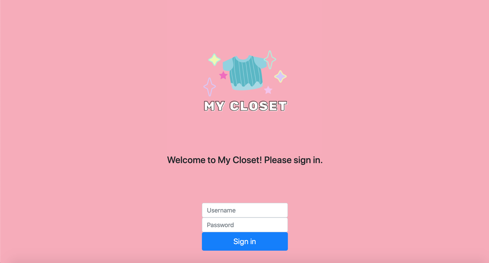
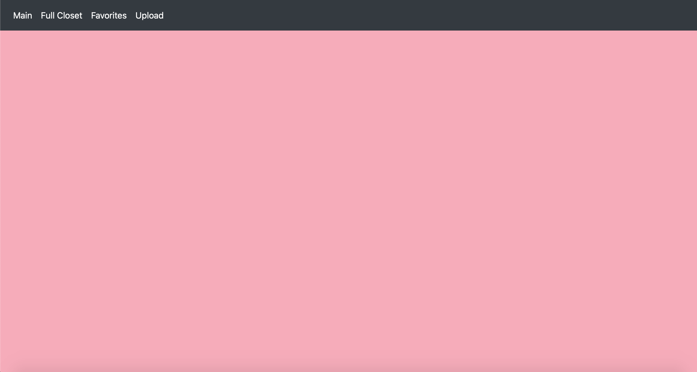
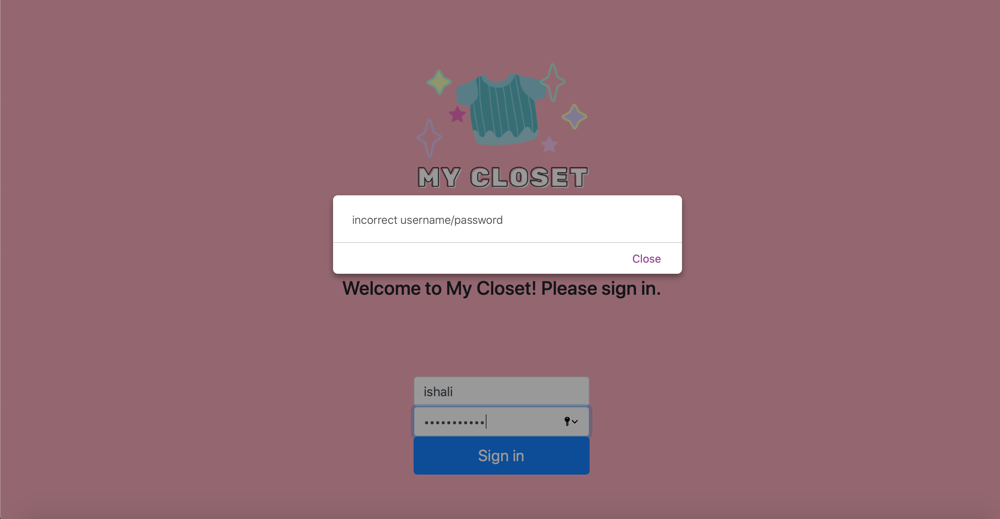
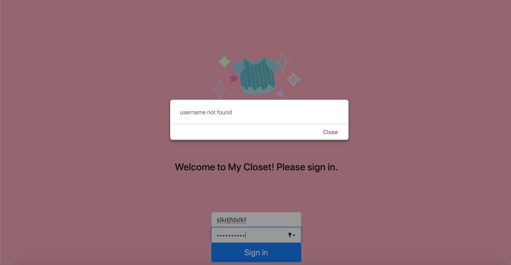

#My Closet

Our plans for this Homework:

10/4 - 10/10
- Research about PHP login
- Set up the classes and the necessary functions needed for the backend
- Take pictures of clothing
- Knowledge: understand PHP login
- Vananh: Work on setting up php login page
- Isha: gather all of clothing pictures

10/11-10/17
- Implement the database and test the necessary function to make sure it is rock solid
- Knowledge: understanding the index of MySQL
- Vananh: work on database design, create table, columns
- Isha: Figure out inheritance

10/18-10/24
- Test backend to make sure everything is as should be
- Vananh: double check connection to database, set up PHP to intake sql statements
- Isha: Work more on classes set up

Accomplished tasks:
- Pictures of clothing for basic database
- Basic graphics
  - added logo
  - pink theme
- SQL database setup (tables, columns, variables)
- Functioning sign in pages 
  - correct login takes you to dashboard, 
  - incorrect password says incorrect password, 
  - non existing user says user not found 
  - after 30 minutes of inactivity, the site will return to login in page
  - After learning more about the login system, we managed to get ahead and implement our login right away (instead of waiting for the next homework deadline).
- Classes & Inheritance around 70% done
  - There were a few modification with our classes, outside of the clothing, closet, and generator classes, we concluded that we needed to implemented a few child classes that inherit from the clothing classes, that is a bottom class, top class, onepiece class, and sweater class. We decided this was necessary because having these classes will help us differentiate between different type of clothing.
  - Classes we have done so far:
    - Clothing Class: has get method to return information (type, color, temp, pattern, occasion, file tile)
- need to test SQL tables in PHP
  - users table is functional for sign in

Next Deadline Plan: 

10/25 -10/31
- Start working on the PHP login (CHANGE: PHP login already implemented, so now we only need to include a logout button)
- Design User Interface with an updated Figma
- Knowledge: PHP
- Vananh: Finalize PhP login 
- Isha: Finalize classes

11/1-11/7
- Start implementing the HTML and work on CSS for better User Interface Design
- Present clothing onto webpage (CHANGE: added task to test out if pictures are presented well onto our page, before we start implementing the generation of outfits)
- Vananh: work on CSS
- Isha: create better graphics/interface w/CSS

11/15-12/21
- Connect Frontend and Backend, publish site
- Knowledge: Integration Layer, publishing
- Test our classes with our actual clothing pictures (CHANGE: added task, we want to get this done earlier to make sure we have enough time to work around errors)
- Vananh: Make sure frontend and backend work nicely
- Isha: User upload
