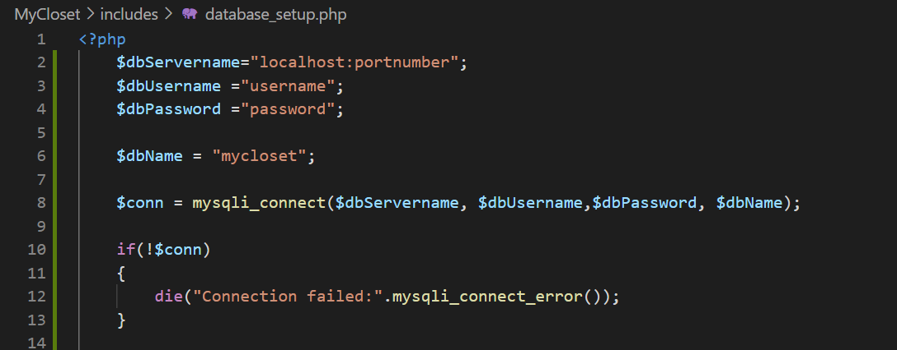

# MyCloset
Project for CSCI 3010.

By: Vananh Le & Isha Karki

This project is a website that allows users to essentially have their entirety of 
their closet all in one place. Based on a user's input of occasion or weather, our program will
find a relevant outfit for the user from the clothes in their closet. 

This project will heavily rely on PHP to act as the front end, back end, and integration layer. We intend to
use HTML/CSS for the front-end from PHP, as well as use SQL for the database.

To run this project, you must have XAMPP downloaded to your computer. XAMPP is a web server solution stack package developed by Apache Friends. Upon downloading, 
please be sure to start the MySQL Database server as well as the Apache Web Server. This will allow us to view the project in your browser.

Link to download XAMPP: https://www.apachefriends.org/index.html

Instruction for downloading XAMPP on Mac: https://www.youtube.com/watch?v=L2X6fDiqOC4
- Current version for Mac: 7.4.11

Instruction for dowloading XAMPP on Window 10: https://www.youtube.com/watch?v=N6ENnaRotmo
- Current version for Window 10: 7.4.11

Instruction for dowloanding XAMPP on Linux: https://www.youtube.com/watch?v=R5CUn5wGQGg
- Current version for Linux: 7.4.11

On Mac, you need to access your Applications folder where you'll see the folder containing the XAMPP files. In there, access your htdocs folder. Then, we would need to store the MyCloset folder. 
You might have to access the base directory of your Mac to see the XAMPP folder under Applications. To run the project, you need to have XAMPP in the background (APACHE and MySQL started).

On Window 10, you would need to access you Local Disk, find the htdocs folder in the XAMPP folder. You must store your MyCloset project within the htdocs folder. To run the project, you need to have XAMPP in the background (APACHE and MySQL started).

On Linux, check the location of your htdocs. It should be in opt/lampp, make sure your MyClass project is save in the htdocs folder. To run the project, please have XAMPP started and running in the background (APACHE and MySQL started).

To see the project in your browser, access your local host port for XAMPP / the foldername (in our case it will be localhost/MyCloset). Note the if you have a different port in your XAMPP (check in the XAMPP Control Panel for the port listed for the Apache file) you must include that port in the following manner (localhost:portnumber/MyCloset) 

To start XAMPP:
Windows: Look for the XAMPP Control Panel on your computer and open it, and start Module Apache and Module MySQL.
Mac: Navigate to "Manage Servers", click "MySQL Database" and hit "Start", and click "Apache Web Server" and hit "Start".
Linux: Similar to Mac.

To set up the database:

Make sure XAMPP is started! Go to your browser and access phpMyAdmin (localhost/phpMyAdmin or localhost:portnumber/phpMyAdmin)

Create a database call mycloset.

Execute the following SQL queries:

>CREATE TABLE IF NOT EXISTS account(
>    id INT(11) AUTO_INCREMENT, 
>    firstname TINYTEXT,
>    lastname TINYTEXT,
>    username TINYTEXT,
>    pwd LONGTEXT,
>    PRIMARY KEY(id)
);

>INSERT INTO account
>   (firstname,lastname,username,pwd)
>VALUES
>    ('firstname','lastname','yourusername',’yourpassword’
);

>CREATE TABLE IF NOT EXISTS clothing( idclothing INT NOT NULL AUTO_INCREMENT, nameofclothing TINYTEXT, typeofclothing TINYTEXT, color TINYTEXT, pattern TINYTEXT, occasion INT, file_title LONGTEXT, type_ TINY TEXT, PRIMARY KEY(idclothing) 
);

>CREATE TABLE IF NOT EXISTS outfits( idOutfit INT NOT NULL AUTO_INCREMENT, name TINYTEXT, bottoms INT, shirts INT, sweaters INT, onepieces INT, temperature INT, occasion INT, PRIMARY KEY(idOutfit) );

For the user reference if do not want to manual upload the clothing:
>INSERT INTO clothing(
    nameofclothing,typeofclothing,color,pattern,occasion,file_title,type_)
VALUES
	('Tan Fancy Jacket','Jacket','Tan',False,4,'anotherfacy_jacket.PNG','Sweater'),
    ('Black Cardigan','Cardigan','Black',False,2,'black_cardigan.PNG','Sweater'),
    ('Oversized Black Pant','Pant','Black',False,2,'black_pant_big.PNG','Bottom'),
    ('Black Professional Dress','Short Dress','Black',False,3,'black_prof.PNG','Onepiece'),
    ('Black Short','Short','Black',False,1,'black_short.png','Bottom'),
    ('Black Skirt','Skirt','Black',False,2,'black_skirt.PNG','Bottom'),
    ('Black Business Pant','Pant','Black',False,3,'blackbusinesspants.PNG','Bottom'),
    ('Oversized Black Cardigan','Sweater','Black',False,2,'blackcardigan.PNG','Sweater'),
    ('Black Formal Shirt','Long Sleeve','Black',False,3,'blackformalshirt.PNG','Shirt'),
    ('Black Jumpsuit','Jump Suit','Black',False,4,'blackjumpsuit.PNG','Onepiece'),
    ('Black Turtleneck','Pullover','Black',False,2,'blackturtleneck.PNG','Sweater'),
    ('Black Long Dress','Long Dress','Black',False,4,'blacl_longdress.PNG','Onepiece'),
    ('Blue Dress','Short Dress','Blue',False,3,'blue_dress.PNG','Onepiece'),
    ('Blue Fancy Dress','Long Dress','Blue',False,4,'blue_fancydress.PNG','Onepiece'),
    ('Blue Denim Jacket','Jacket','Blue',False,2,'blue_jacket.PNG','Jacket'),
    ('Blue Long Dress','Long Dress','Blue',False,4,'blue_longdress.PNG','Onepiece'),
    ('Blue Denim Short','Short','Blue',False,2,'blue_short.PNG','Bottom'),
    ('Blue and White Short','Short','Multi-Colored',True,1,'blueandwhiteshorts.PNG','Bottom'),
    ('Blue Cardigan','Cardigan','Blue',False,2,'bluecardigan.PNG','Sweater'),
    ('Brown Long Shirt','Long Sleeve','Brown',False,2,'brown_sleeve.PNG','Shirt'),
    ('Business Cardigan','Cardigan','Multi-Colored',False,3,'business_cardigan.PNG','Sweater'),
    ('Yellow Cat Shirt','T-Shirt','Yellow',True,1,'catshirt.PNG','Shirt'),
    ('White Pullover','Pullover','White',False,2,'champion_pull.PNG','Sweater'),
    ('Checkered Blouse','Blouse','Multi-Colored',True,2,'checkered_top.PNG','Shirt'),
    ('Graphic Tank Top','Tank Top','White',False,1,'fan_tank.PNG','Shirt'),
    ('Fancy Black Shirt','Long Shirt','Black',False,4,'fancy_black_shirt.PNG','Shirt'),
    ('Fancy Black Skirt','Skirt','Black',False,4,'fancy_black_skirt.PNG','Bottom'),
    ('Fancy Tan Jacket','Jacket','Tan',False,4,'fancy_jacket.PNG','Sweater'),
    ('Flower Blouse','Blouse','Blue',True,2,'flowershirt.PNG','Shirt'),
    ('Brown Fur Jacket','Jacket','Brown',False,2,'fur_jacket.PNG','Sweater'),
    ('Green Cardigan','Cardigan','Green',False,2,'green_cardigan.PNG','Sweater'),
    ('Green Dress','Short Dress','Green',False,2,'green_dress.PNG','Onepiece'),
    ('Green Pullover','Pullover','Green',True,2,'green_pull.PNG','Sweater'),
    ('Green Cargo Pants','Pant','Green',False,2,'greencargopants.PNG','Bottom'),
    ('Grey Dress','Short Dress','Grey',False,3,'grey_dress.PNG','Onepiece'),
    ('Business Grey Jacket','Jacket','Grey',False,3,'grey_jacket.PNG','Sweater'),
    ('Grey Cardigan','Cardigan','Grey',False,1,'greycardigan.PNG','Sweater'),
    ('Fancy Grey Jacket','Jacket','Grey',True,4,'greyjacket.PNG','Sweater'),
    ('Blue Jeans','Pant','Blue',False,2,'jeans.PNG','Bottom'),
    ('Pink Party Dress','Short Dress','Pink',False,4,'pink_party.PNG','Onepiece'),
    ('Bright Pink Jacket','Jacket','Pink',False,1,'pink_sweater.PNG','Sweater'),
    ('Puffer Jacket','Jacket','Black',False,2,'puffer_jacket.PNG','Sweater'),
    ('White Tank Top','Tank Top','White',True,2,'tanktop.png','Shirt'),
    ('Graphic T-Shirt','T-Shirt','White',False,1,'tshirt.png','Shirt'),
    ('White Long Dress','Long Dress','White',False,4,'white_longdress.PNG','Onepiece'),
    ('White Loose Pant','Pant','White',False,2,'white_pant.PNG','Bottom'),
    ('White Long Sleeved Shirt','Long Shirt','White',False,3,'white_shirt.PNG','Shirt'),
    ('White Sleeveless Tank','Tank Top','White',False,2,'white_tank.PNG','Shirt'),
    ('White Sweater','Long Sleeve','White',False,2,'whitesweater.PNG','Shirt'),
    ('Yellow Flower Dress','Short Dress','Yellow',True,3,'yellow_dress.PNG','Onepiece'),
    ('Yellow Polka Dot Dress','Short Dress','Yellow',True,2,'yellow_poka.PNG','Onepiece'),
    ('Graphic Yellow Hoodie','Pullover','Yellow',False,1,'yellowhoodie.PNG','Sweater'),
    ('Red Skirt','Skirt','Red',False,3,'red_skirt.PNG','Bottom'),
    ('Striped Romper','Romper','Multi-Color',True,2,'stripe_romper.PNG','Onepiece'),
    ('Sellout Hoodie','Pullover','Black',False,1,'sellout_hoodie.PNG','Sweater'),
    ('Striped Tank Top', 'Tank Top', 'Multi-Color', True, 2, 'stripe_tanktop.png', 'Shirt'),
    ('Striped Carnival Top', 'Tank Top', 'Multi-Color', True, 2, 'stripe_tank.PNG', 'Shirt'),
    ('Striped Shirt', 'Long Sleeve', 'Multi-Color', True, 3, 'stripe_shirt.PNG', 'Shirt'),
    ('Striped Jump Suit', 'Jump Suit', 'Multi-Color', True, 4, 'stripedjumpsuit.PNG', 'Onepiece'),
    ('Grey Turtle Neck', 'Long Sleeve', 'Gray', False, 3, 'sweater.png', 'Shirt')
;

Getting the database working really depend on how you set up your XAMPP. To check if your database connection is correct, go to the MyCloset/includes/database_setup.php file to modify the username, password, and port as needed. 

$dbServername="localhost:portnumber"; <= in replacement of portnumber, include the port where MySQL is running. To check this go to your XAMPP Control Panel, then check the port listed for MySQL

$dbUsername ="username"; <= in replacement of username, check your username for MySQL by going to "\xampp\phpMyAdmin\config.inc.php" and look at the line $cfg['Servers'][$i]['user'] = 'username'; and adjust the  database_setup.php accordingly

$dbPassword ="password"; <= in replacement of password, check your username for MySQL by going to "\xampp\phpMyAdmin\config.inc.php" and look at the line $cfg['Servers'][$i]['password'] = 'password'; and adjust the  database_setup.php accordingly

$dbName = "mycloset"; <= make sure your database for this project is named "mycloset"

To login to the site, go to localhost/MyCloset or localhost:portnumber/MyCloset. Then input the username and password that was set up in your mycloset database under the account table. To check the username and password that is under the account table, go to localhost/phpMyAdmin or localhost:portnumber/phpMyAdmin, then click on mycloset schema, then click on the account table to view

