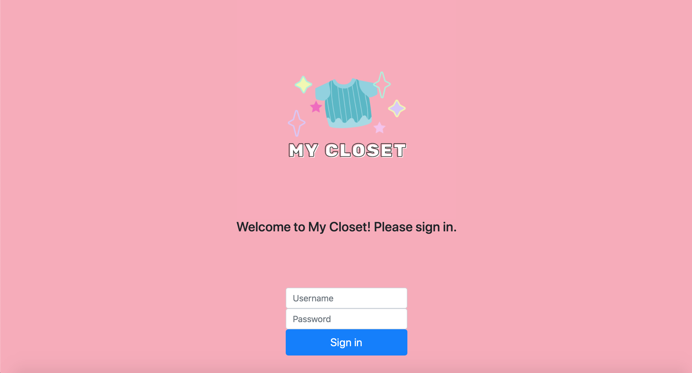
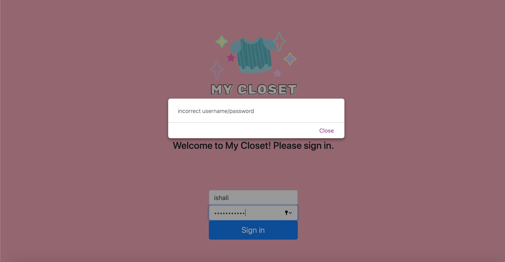
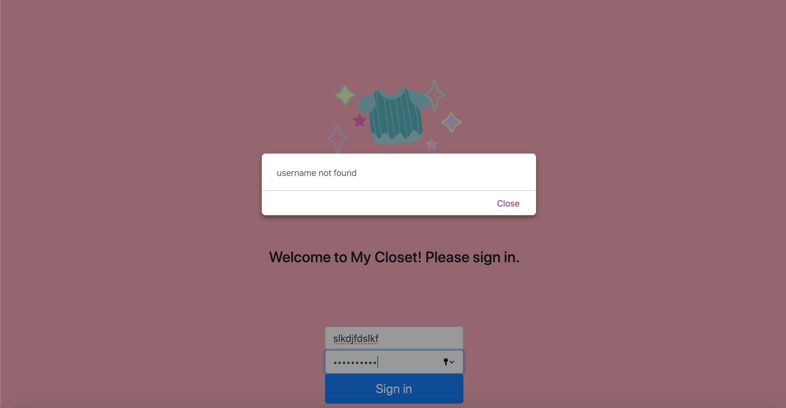

#My Closet

Our plans for this Homework:

10/4 - 10/10
- Research about PHP login
- Set up the classes and the necessary functions needed for the backend
- Take pictures of clothing
- Knowledge: understand PHP login
- Vananh: Work on setting up php login page
- Isha: gather all of clothing pictures

10/11-10/17
- Implement the database and test the necessary function to make sure it is rock solid
- Knowledge: understanding the index of MySQL
- Vananh: work on database design, create table, columns
- Isha: Figure out inheritance

10/18-10/24
- Test backend to make sure everything is as should be
- Vananh: double check connection to database, set up PHP to intake sql statements
- Isha: Work more on classes set up

Accomplished tasks:
- Pictures of clothing
  - stored in includes/img folder
  - currently have 9 clothing images: 3 bottoms, 4 tops, 1 dress, 1 jacket
- Basic graphics
  - added logo (logo stored in includes/img folder)
  - pink theme (based on our FIGMA we implemented a pick background)
- SQL database setup (tables, columns, variables):
  - account table structure 
    - The purpose of the account table is to store the users who are able to login to the website, it stores in needed credential to log in
      - id: primary key
      - firstname: first name of the user
      - lastname: last name of the user
      - username: the username of the user
      - pwd: the password of the user
    - currently have two users within account page 
  - clothing table structure 
    - The purpose of the clothing table structure is to store all of the information of a piece of clothing.
      - idclothing: primary key
      - typeofclothing: the type of clothing it is such as skirt, tanktop, dress etc.
      - color: the main color of the piece of clothing
      - temp: the amount of heat/warmth the piece will provide
      - pattern: whether or not the piece of clothing has pattern
      - occasion: where the piece of clothing is most suitable
          - 1: very casual
          - 2: casual hangout
          - 3: business
          - 4: fancy party
      - file_title: the name of the picture file
    - currently do not have any row in the clothing table
  - outfit table structure 
    - The purpose of the outfit table is to store the outfits that the user particularly love
      - idOutfit: primary key
      - name: name of the outfit
      - bottoms: the outfit's bottom if any
      - shirts: the outfit's top if any
      - sweaters: the outfit's sweater if any
      - onepieces: the outfit's onepiece if any
      - temperature: the amount of heat the outfit will provide
      - occasion: where the outfit will be most suitable
- Functioning sign in pages 
  - correct login takes you to dashboard, 
  - incorrect password says incorrect password, 
  - non existing user says user not found 
  - after 30 minutes of inactivity, the site will return to login in page
  - After learning more about the login system, we managed to get ahead and implement our login right away (instead of waiting for the next homework deadline).
  - database connection works for signing in. 
  - account table is set up in phpMyAdmin, containing the user informations (firstname, lastname, username, and password)
- Classes & Inheritance around 70% done
  - There were a few modification with our classes, outside of the clothing, closet, and generator classes, we concluded that we needed to implemented a few child classes that inherit from the clothing classes, that is a bottom class, top class, onepiece class, and sweater class. We decided this was necessary because having these classes will help us differentiate between different type of clothing.
  - Classes we have done so far:
    - Clothing Class: has get method to return information (type, color, temp, pattern, occasion, file tile)
    - In order to (potentially) implement Prototype design pattern, need to include some sort of Clone method
    - Closet Class: holds private variables of arrays of each subclass of Clothing (bottoms, shirts, sweaters, onepieces)
    - things to implement: how the saved outfits will be stored, where the outfit generator function will belong (class of its own or Closet function?)

Next Deadline Plan: 

10/25 -10/31
- Start working on the PHP login (CHANGE: PHP login already implemented, so now we only need to include a logout button)
- Design User Interface with an updated Figma
- Knowledge: PHP
- Vananh: Finalize PhP login
  - mostly satisfied with current features - logs in properly, outputs correct error messages, returns user back to login page
    after 30 minutes of inactivity
  - things to add: log in vs log out feature
- Isha: Finalize classes 
  - currently have a rough draft of the classes
  - need to implement mentioned features: how the saved outfits will be stored, where the outfit generator function will belong (class of its own or Closet function?)
  - also find out the design pattern if Prototype doesn't work out

11/1-11/7
- Start implementing the HTML and work on CSS for better User Interface Design
- Present clothing onto webpage (CHANGE: added task to test out if pictures are presented well onto our page, before we start implementing the generation of outfits)
- Vananh: work on CSS
- Isha: create better graphics/interface w/CSS - create a nicer logo, possibly animated?
- to work on for both: try and "modernize" the UI using something similar to Bootstrap, test how the site looks from a mobile view (i.e. making the window size smaller), test pictures' display

11/15-12/21
- Connect Frontend and Backend, publish site
- Knowledge: Integration Layer, publishing
- Test our classes with our actual clothing pictures (CHANGE: added task, we want to get this done earlier to make sure we have enough time to work around errors)
- Vananh: Make sure frontend and backend work nicely
  - do the correct images come out? do the buttons link to right pages?
- Isha: User upload
  - implement user upload, where user can upload their own images to add to the database
