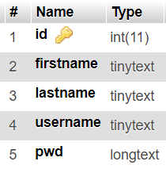
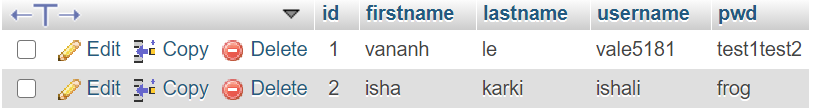
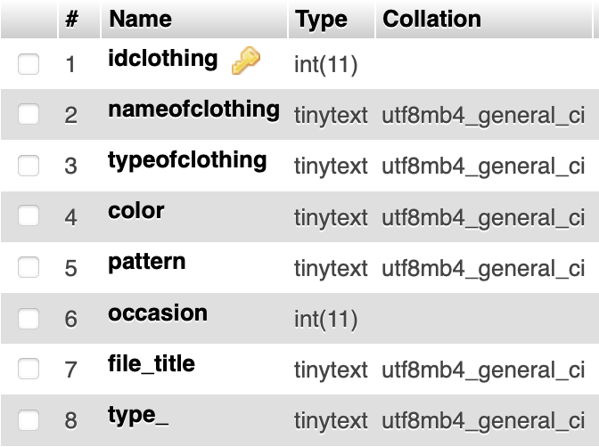
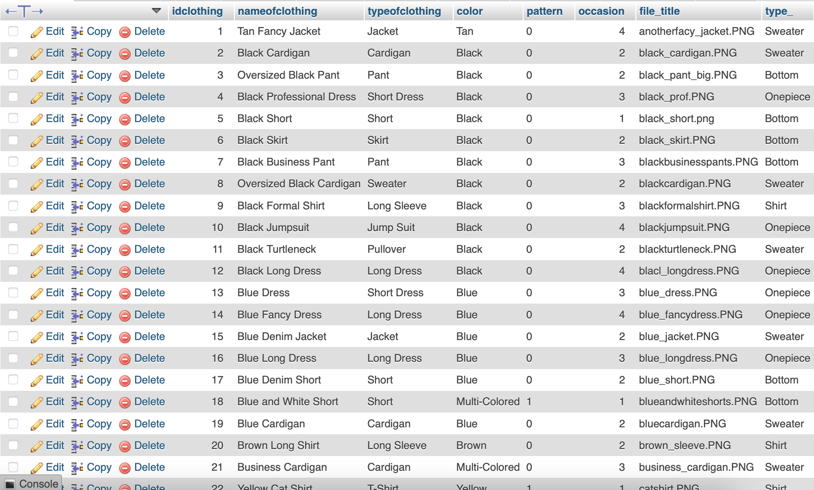
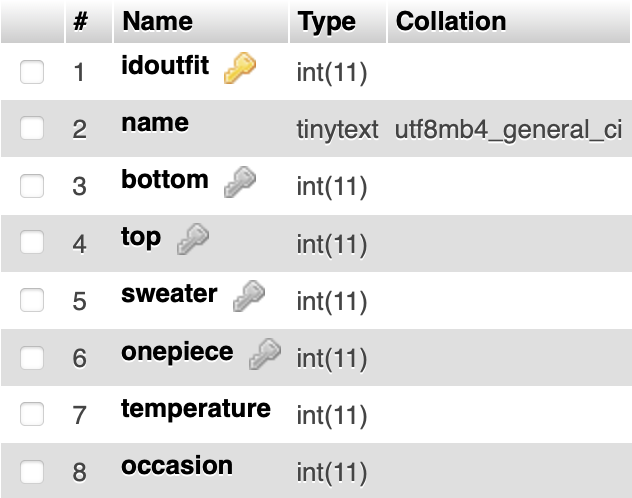

# My Closet

## What was planned for this deadline:

For this deadline, we had planned to implement the save feature. The save feature allows the user to save their randomly generated outfit as one of their favorites, which can be seen on a separate page at any time by the user.
Another thing we had planned for this deadline was to work on the UI. We wanted it to look cleaner and more modern. This feature was the most focused on for this deadline, as all of our other features that we wanted have been implemented.

## What was accomplished for this deadline:

We accomplished everything that was planned for this deadline plus some more. The save feature was implemented, so now after a user generates a random outfit on the main page, they have the option to save it under a name of their choice. This 
implementation required us to make changes to the outfit table structure that we have in our database. Originally, our outfit table consisted of an outfit ID, an outfit name, integer values to represent the different pieces of the outfit, an integer temperature value, and an occasion.
As seen in the screenshots below, the outfit table now has an outfit ID, an outfit name, string values for the image file names for each of the pieces, a string temperature value (cold, warm, hot), and what occasion it falls under. 
These changes were necessary to make the save feature more intuitive, especially with the change from integer to string values for the different pieces of the outfit. Implementing these changes allowed us to easily display the saved outfits to the user on their favorite page 
by using the file names saved in the string values to display the images of the outfit pieces. 
We also made major changes to the UI of our website. There were a lot of features added via HTML/CSS implementations. First is the overall color scheme, which now makes use of 3 major colors: black, hot pink, and a softer pink color. 
There were also changes to the logo both on the main login page and the navbar, which were drawn by hand. 
Then there is the responsive navigation bar, which now looks a lot cleaner and has a cool effect of a black bar coming in and out when you hover over a nav item. The logo was also implemented into the navbar, which upon click will take you back to the main page as well.
On the favorites page, the outfit display was also updated. Making use of containers, we were able to organize all of the images in a saved outfit in a way that looks good. It also displays the outfit name, which temperature you'd wear the outfit for, and the occasion it falls under.
The full closet page was also modified slightly to make all of the different pieces more consistent in size, as well as the labels for them.

## Plans for the next deadline:

None! Submission time :)

# Video Runthrough

- link here!

# Screenshots
- accounts table in our database: 
- 
- actual accounts in our database (user & pwd): 
- 
- clothing table: 
- 
- first ~20 rows of clothing data (total around 50+): 
- 
- outfit table: 
- 
